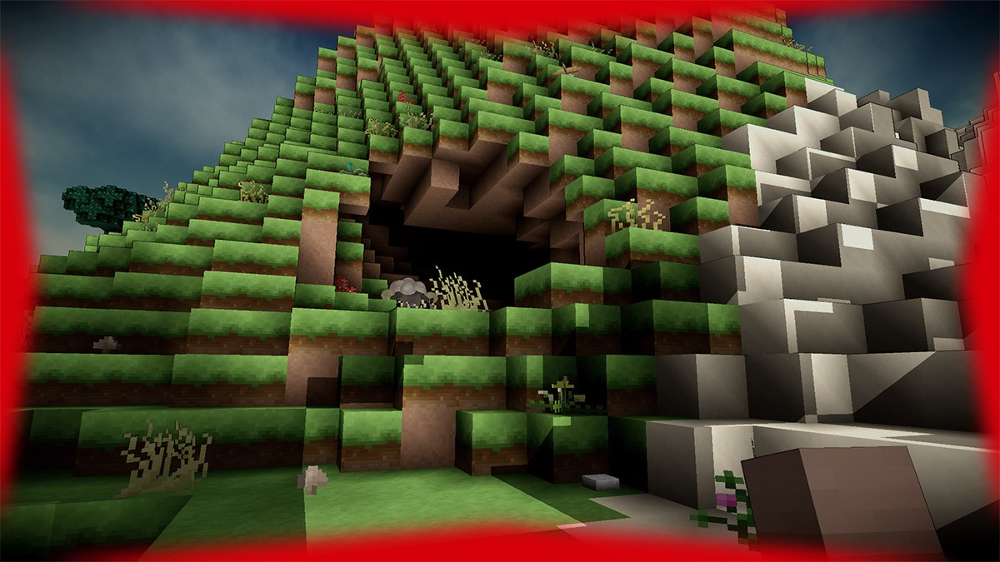
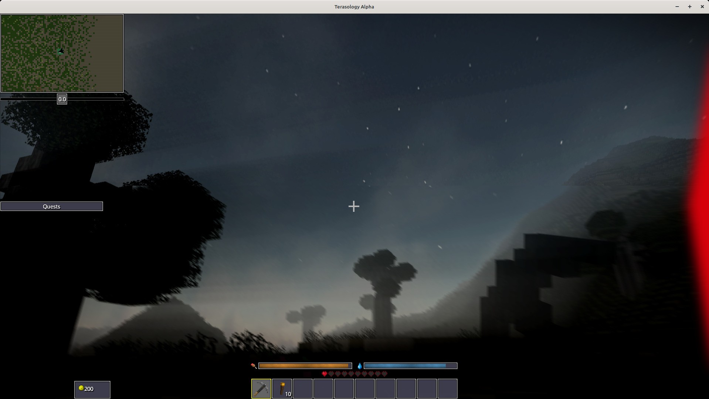

# Damage Overlay

The `Health` module adds a visual overlay whenever the you are damaged.
If you hurt yourself, for instance through drowning or fall damage, the default damage overlay is displayed.
It consists of four red indicators, one on each side of your screen.
The default damage overlay is also shown when you are hurt by an effect such as poison.

In case of an external cause, for instance another player or an NPC attacking you, the overlay will be directional.
There will only be one red indicator, marking the direction of origin of the damage cause.
This will allow you to locate the external cause that is hurting you.

